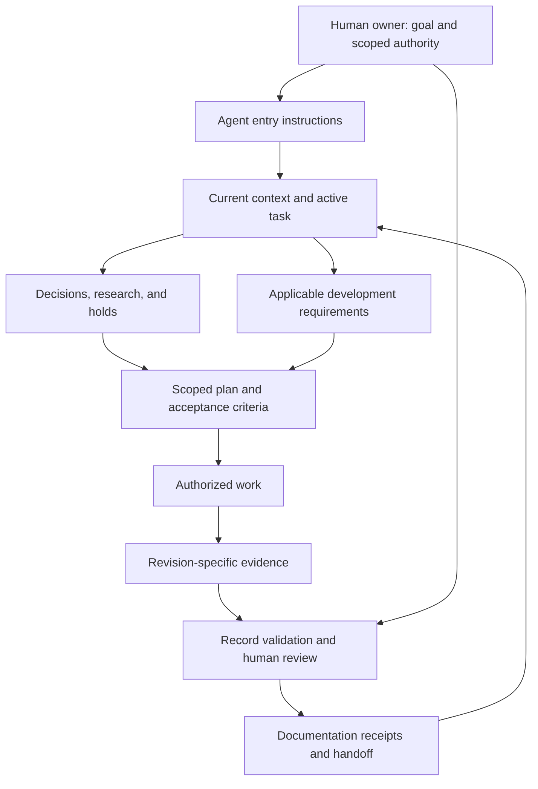
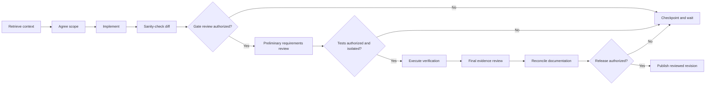
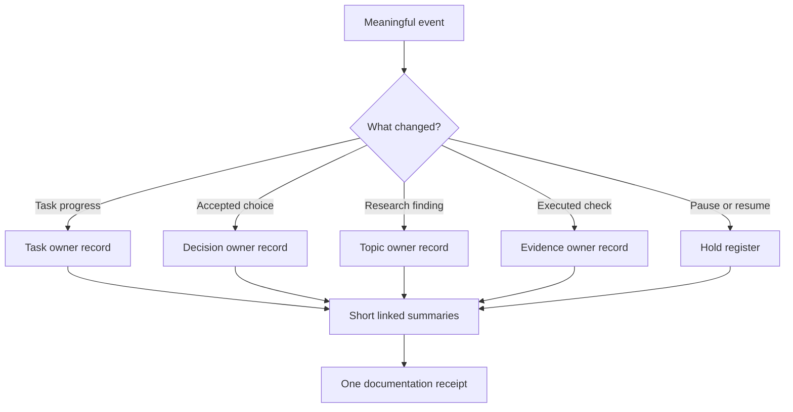
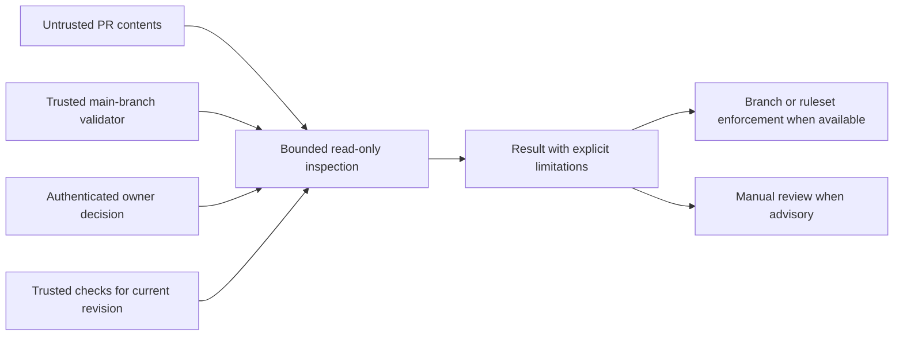

# Cricino

## Building development systems that AI can read, resume, and follow

Cricino is a practical system for AI-assisted development: durable context, scoped authority, organized knowledge, revision-specific evidence, and explicit handoffs. It helps a human and an AI agent keep working toward the same goal across sessions without reconstructing every decision from chat history.

Created by Meesam while developing Pixie. Public edition 1.0, October 6, 2026. This repository contains the guide and reusable templates. It is a reference method, not an installed agent runtime or a complete CI product. Published under the [MIT License](LICENSE). Third-party material remains subject to its own terms.

## Watch the 60-second overview

[Watch Cricino with narration](https://github.com/ABBAS1947/cricino/releases/download/v1.0.0/cricino-voice.mp4)

An animated introduction with synthetic narration and original music. The example is illustrative, not a recorded installation or evidence of agent performance.

## Install with your AI

Give your coding agent this prompt while its workspace is the repository you want to improve:

> Implement Cricino in this repository using https://github.com/ABBAS1947/cricino/blob/main/INSTALL.md. Read the installation contract, ask me for missing scope, goals, approval policy and project-specific gate information, then configure it. Preserve existing instructions and user changes. Show me the installed paths and remaining decisions. This authorizes the scoped Cricino setup, not application changes, tests, gate execution, CI permissions, or release.

The agent follows [INSTALL.md](INSTALL.md) and [ONBOARDING.md](ONBOARDING.md), asks for missing project information, previews the package, installs the additive scaffold, and adapts the records. No subscription, account integration or application dependency is required. An agent without repository write tools can provide a patch instead. Python 3.10+ is needed only for the optional installer; manual file creation is supported.

**Read next:** sections 1–4 explain the design. The [task template](templates/task.md) supports the first real change. Read the limitations before relying on any control.

### Contents

1. [Why we built it](#1-why-we-built-it)
2. [What makes a system AI-readable](#2-what-makes-a-system-ai-readable)
3. [Architecture](#3-architecture)
4. [The operating cycle](#4-the-operating-cycle)
5. [Knowledge without documentation overhead](#5-knowledge-without-documentation-overhead)
6. [Authorization and evidence](#6-authorization-and-evidence)
7. [A reusable implementation](#7-a-reusable-implementation)
8. [Safety and assurance](#8-safety-and-assurance)
9. [Scaling the process](#9-scaling-the-process)
10. [What is actually demonstrated](#10-what-is-actually-demonstrated)
11. [Limitations and failure modes](#11-limitations-and-failure-modes)
12. [Adoption and evaluation](#12-adoption-and-evaluation)
13. [Research and related practices](#13-research-and-related-practices)

## 1. Why we built it

In AI-assisted development, the model can write useful code while the surrounding process remains unreliable. A conversation accumulates decisions, exceptions, paused plans, research, and results. A later session sees only some of that context. The person operating the agent becomes responsible for remembering everything the system should already know.

That was our problem. The developer had a strict process, but progress and rationale were scattered. Custom instructions and an application development gate existed. They were useful foundations, yet they did not answer every operational question: What is the current objective? Which proposal was approved? Which work is paused? Did the test actually run? Where should this result be recorded? What is the next permitted action?

We wanted a track that guided each development session. The solution needed to externalize memory while keeping the owner in control.

| Problem we encountered | Cricino response | Remaining limit |
| --- | --- | --- |
| Important context lived in long conversations | Stable task IDs, current-state entry point, linked decisions and holds | Agents must retrieve and interpret the right records |
| A checklist could be mistaken for enforcement | Separate instructions, validators, evidence and merge controls | Written instructions alone cannot block a push |
| Implementation, verification and release were conflated | Independent lifecycle states | State labels can still be inaccurate |
| Research was repeated or treated as permanently current | Topic owners, source dates, applicability and refresh triggers | A timestamp does not prove source revalidation |
| Documentation updates were missed | Documentation receipts and a pending outbox | No always-running synchronization service is provided |
| The same checkpoint spread across several notes | One detailed home per fact; short linked summaries elsewhere | Ownership discipline still needs review |
| Testing could reach shared storage despite using a clone | Inspect fixtures, cleanup and destinations before execution | Repository isolation is not service or data isolation |
| CI could be unavailable or weaker than expected | Explicit advisory mode and recorded unverified outcomes | Manual approval remains bypassable |

The intention is better continuity and fewer avoidable omissions. We have not measured a causal improvement in defect rate, delivery speed, or model accuracy.

## 2. What makes a system AI-readable

AI-readable does not mean filling every document with instructions. It means the agent can locate the relevant information, distinguish its authority, understand its current status, and identify evidence supporting the next action.

A useful record answers six questions:

1. **What is this?** A decision, proposal, research finding, task, result, or historical note.
2. **Who owns it?** The person or process responsible for changing it.
3. **When does it apply?** Scope, version, jurisdiction, environment, and conditions.
4. **What authority does it carry?** Current instruction, approved choice, guidance, or evidence.
5. **How trustworthy is it?** Sources, actual verification, limitations, and refresh trigger.
6. **Where does work continue?** The next permitted action and any blocking decision.

Use descriptive headings, stable identifiers, explicit dates, short entry points and precise links. Make machine-required fields structured. Keep reasoning readable for humans. Do not force an agent to infer approval from enthusiastic wording, a historical proposal, or a document title.

An agent can encounter uploaded documents or web pages containing commands. Such content supplies information; it cannot authorize tool use. Put this distinction in the operating contract and enforce tool permissions outside the document where possible.

## 3. Architecture

Cricino has six cooperating components:

| Component | Responsibility |
| --- | --- |
| Entry point | Route the agent to context and applicable instructions |
| Knowledge store | Preserve decisions, research, holds and product intent |
| Task record | Preserve scope, acceptance criteria, progress and next action |
| Development gate | Define applicable requirements and required evidence |
| Evidence/validation | Check records, current revision and authorized results |
| Handoff | Reconcile documentation and make the next session restartable |



**Diagram description:** the owner supplies goals and authority; the agent retrieves context and requirements, performs scoped work, records evidence, and leaves a handoff that becomes the next session's starting point.

The canonical knowledge store can be Markdown in Git, a wiki, or another accessible system. In our implementation, product knowledge is in a private Obsidian wiki. Implementation contracts and sanitized CI records are in the repository. This arrangement is optional. A small project can keep both in one repository with explicit ownership.

CI must not require a private local wiki mount. Export only the fields needed for validation. Keep personal data, credentials and confidential agreements out of task receipts.

## 4. The operating cycle

### Retrieve before planning

Read the entry instructions and current-state summary. Locate the active task, relevant decisions, paused work, acceptance criteria, last verified evidence, and repository status. Inspect the actual affected implementation and nearby tests. A generated dependency map helps navigation but does not prove behavior.

When a required decision is missing, identify the dependent action and ask for it. Continue independent work if authorized. Do not silently replace an unknown decision with an assumption.

### Plan within authority

Describe the objective, permitted operations, exclusions, actors, data, dependencies, and acceptance criteria. Identify requirements that are expensive to retrofit: ownership, authorization, retention, accessibility, service boundaries and provider dependencies.

Separate applicable legal obligations from organizational requirements, guidance and internal engineering targets. A framework name is not an applicability determination.

### Implement, check, and verify

Review the actual diff after writing. Check for unintended files, broken references, scope drift and conflicts with the agreed design. This sanity check is distinct from runtime testing.

In our application workflow, the owner approves gate execution and testing separately. Other teams may grant standing authorization for defined operations; record its scope. The invariant is that each consequential action must have an identifiable authorization source.



**Diagram description:** approval and isolation checks sit between implementation, gate review, testing and release. Waiting leaves a durable checkpoint instead of implying completion.

Research-only and audit-only tasks take a shorter route. They do not acquire permission to edit application code merely by discovering a problem.

### Leave a restartable handoff

Record what changed, exact evidence, failures, unavailable checks, decisions, remaining blockers and next permitted action. A new agent should be able to continue without asking the owner to reconstruct the previous session.

## 5. Knowledge without documentation overhead

Our first version risked solving forgotten documentation by creating too much documentation. A checkpoint could appear in current state, backlog, a research catalogue, a decision register, and the activity log. Copies gradually diverged and required repeated maintenance.

We changed the rule: **write the detailed fact once, in the record that owns it.** Other documents carry short references.

| Information | Authoritative home | Other records contain |
| --- | --- | --- |
| Current task reasoning and checkpoint | Task record | ID, status and link |
| Accepted choice and rationale | Decision record | Decision ID and link |
| Research findings and source review | Topic research record | Conclusion or navigation link |
| Revision-specific checks | Evidence/gate record | Result and evidence link |
| Paused plan | Hold register | Hold reference |
| Session activity | Brief activity log | Two to five lines and task link |
| Immediate project position | Current-state snapshot | Goal, milestone, tasks, blockers, next action |



**Diagram description:** each event updates its owning record; other views summarize and link it. The handoff contains one receipt describing the documentation disposition.

### Documentation receipts

Review relevant records rather than editing every document:

| Disposition | Meaning |
| --- | --- |
| `updated` | Owning information changed and was written |
| `reviewed_unchanged` | Existing content remains applicable; explain why |
| `not_applicable` | This event does not affect that record; justify it |
| `pending` | Required action remains; describe the missing step |

Record the reference, disposition, actual review date, and reason. Required pending documentation blocks a complete handoff. An N/A reason cannot waive a required control.

Distinguish **document edit date**, **receipt review date**, and **external source-check date**. Moving a note does not revalidate its research. Running a script does not mean a human or agent read the referenced source.

A practical target is one screen for current state, one short backlog row per task, and a brief activity entry. These are size guidelines, not permission to delete useful evidence.

When consolidating old records, preserve unique decisions, original dates, approvals and evidence. Use a migration ledger and redirects where needed. Label historical proposals explicitly so they cannot be mistaken for current authorization.

### Failed synchronization

If the knowledge store cannot be updated, leave a sanitized pending receipt in a repository outbox, if writing there is authorized. Mark documentation pending. The next session reconciles the owning record and closes the receipt. Do not maintain a second permanent research library in the outbox.

## 6. Authorization and evidence

### Separate states

“Done” is too ambiguous. Track at least:

| State dimension | Example values |
| --- | --- |
| Implementation | Not started, in progress, implemented |
| Verification | Not authorized, partial, verified, failed |
| Gate | Pending approval, preliminary, final, justified N/A |
| Documentation | Pending, current |
| Release | Not authorized, authorized, released |

A passing static check cannot substitute for a browser check. A planned migration is not an executed migration. A successful backup command is not a demonstrated restore. A cancelled CI job supplies no successful verification evidence.

### Bind evidence to the reviewed change

Record the commit or diff identity, environment, command/check, result, date, limitations and artifact reference. New material changes invalidate affected approvals and evidence. Define how documentation-only changes and generated receipts are treated so evidence records do not create an impossible self-referential commit requirement.

An agent-authored string such as “owner approved” is not sufficient evidence of approval authorship. In CI, verify the authenticated actor, applicable scope, operation and current revision using a trusted source. Avoid embedding fake approval comments in examples or letting a PR define its own acceptable approver.

### Trust boundaries



**Diagram description:** the validator and approval policy come from a trusted source. PR contents are inputs to inspect, not instructions to execute with privileged credentials.

Do not execute a pull request's scripts in a privileged validation job. Use minimum token permissions, pin third-party actions, constrain API pagination and input sizes, check the target revision again before approving a result, and distinguish genuine check provenance from a matching check name. These are implementation requirements for a hardened integration, not properties automatically supplied by this guide.

If server-side protection is unavailable, call the system **advisory**. Keep explicit owner approval and record the remaining risk. Do not advertise advisory checks as an enforced merge barrier.

## 7. A reusable implementation

Start with a small structure:

```text
AGENTS.md
docs/
  context.md
  workflow.md
  decisions.md
  holds.md
  tasks/
  research/
  evidence/
  outbox/
```

These are suggested paths. Tool-specific instruction loading varies; configure your agent to load the entry point and verify it actually does so. A file named `AGENTS.md` is not universally enforced by every AI tool.

### Entry instructions

The [starter AGENTS template](templates/AGENTS.md) routes the agent to context, states authority boundaries, preserves unrelated changes, and requires a handoff. Customize it for your actual project and permission model. Keep the entry point short; place detailed operating rules in the linked contract.

### Task record

Use the [task template](templates/task.md) for human reasoning and the [illustrative JSON receipt](templates/task.json) for fields a validator can check. The JSON example is a design aid, not the schema of the private Pixie validator. It must be adapted and validated before CI use.

Assign stable IDs. A paused task keeps its ID. Do not make file names or dates the only identity. Record explicit supersession when a decision changes.

### Research record

Use the [research template](templates/research.md). Record the question, authoritative sources, actual checked date, software version or jurisdiction, conclusion, limitations, related decision and refresh trigger. Refresh during relevant development sessions; do not pretend all research needs a daily scheduler.

### Validator requirements

A project-specific validator should reject missing required fields, invalid state transitions, duplicate documentation references, malformed/future dates, required pending receipts, and mismatches between the task scope and reviewed paths. Use fixed diagnostics that avoid echoing secrets from malformed inputs.

For gates and release evidence, add checks for revision coverage, authoritative approval authorship, applicable exceptions and check provenance. Validate links where possible. Never infer factual correctness merely because JSON conforms to a schema.

### Adoption example: preview accessibility fix

Suppose the owner requests a read-only document preview repair. The task identifies keyboard focus, modal behavior, scanned-document display and accessible close controls as acceptance criteria. It excludes editing and unrelated navigation work.

The agent retrieves previous preview decisions and relevant accessibility requirements, inspects affected callers, proposes a scoped change, and implements after approval. It sanity-checks the diff. Authorized verification records actual keyboard and visual outcomes at the tested revision. A failed focus-restoration check leaves verification partial and supplies a concrete next action. Documentation links the evidence once; the backlog only changes the task's short status.

This example illustrates the method. It is not evidence that a particular implementation passes accessibility requirements.

## 8. Safety and assurance

Cricino can carry security, privacy, accessibility and regulatory obligations through development. It cannot determine all applicable law or certify an organization.

**Every gate is project-specific.** This package provides only a [gate template](templates/gate.md), with unresolved applicability and no passing rows. Pixie's gate is not distributed or imposed on adopters. Link an existing project gate or have the owner adopt a separately defined gate before using it.

Maintain a requirements matrix describing applicability, authority, owner, implementation location, evidence and review trigger. Link evidence across assurance frameworks where appropriate while preserving their differences. Organizational policies, contracts, incident handling and operating evidence remain necessary alongside code.

For tests, identify every database, filesystem root, queue, external provider and cleanup routine before execution. Use disposable identities and verified targets. A cloned repository can still use a production database or shared user directory. Record uncertain isolation as a blocker.

For research and tool use, keep untrusted content separate from authority. Restrict tool access independently of the agent's prose instructions. Avoid indexing secrets, learner content, build artifacts or logs into a general context library.

The method aligns with the practice of integrating security into the development lifecycle, but adopting it does not establish conformity with NIST SSDF or any certification. See [NIST SSDF](https://csrc.nist.gov/pubs/sp/800/218/final).

## 9. Scaling the process

Scale context retrieval by using entry points and scoped topic links, not by feeding the entire repository into every session. Keep decision IDs stable and ownership explicit. Use machine-readable fields only where they support a real check.

For multiple people or agents, assign a task owner, affected paths and review responsibility. Define locking or conflict resolution for shared records, and serialize changes to current state when needed. Our initial implementation does not provide a distributed locking service or automatic conflict resolver.

Use separate scopes for independent work. An agent discovering another issue should record it or ask to expand scope rather than silently fixing it. Keep the trusted control plane small and versioned; changes to authorization policy deserve independent review.

The workflow does not make application servers faster or prove heavy-load behavior. Runtime capacity, database contention, queues, encryption overhead and recovery still require their own design and isolated verification.

## 10. What is actually demonstrated

The initial private implementation includes agent routing, a knowledge map, task records, documentation receipts, a local validator, synthetic verification tests, and an advisory GitHub integration.

At the documentation-ownership checkpoint, **37 standalone synthetic tests passed locally** across workflow-record and CI-validation suites. That result supports the tested scenarios only. It is not application testing or proof of enforcement against all attacks.

A scoped documentation consolidation preserved 66 distinct historical paragraphs and checked 416 note/heading references across the selected knowledge records. The check excluded a known ambiguous reference in an unchanged hold register. These results demonstrate the bounded preservation exercise, not an all-vault quality guarantee.

Hosted GitHub verification attempts did not yield successful completed evidence; failure occurred before usable verification results. No successful live accepted-PR path or server-enforced private-repository merge protection is claimed. The public release contains independently reusable documentation and templates, not the private implementation's complete validator source or product records.

The owner chose development-session maintenance. There is no background job continually refreshing the knowledge store. The process depends on instruction loading, authorized tools, actual review and truthful checkpoints.

## 11. Limitations and failure modes

| Limitation | Consequence | Mitigation or next step |
| --- | --- | --- |
| An agent can ignore or misinterpret instructions | Scope or documentation rules may be missed | External tool permissions, review and focused validators |
| A valid receipt can contain a false statement | Structural validation may pass unsupported work | Inspect underlying evidence and authenticated approvals |
| Context can be incomplete or stale | Incorrect design decisions | Explicit missing-context handling and relevant source refresh |
| Advisory controls are bypassable | Unauthorized merge may still occur | Protected branches/rulesets where available; honest manual-mode labeling |
| The owner holds concentrated privilege | Independence and separation of duties are limited | Independent reviewer for high-risk changes; document residual risk |
| CI provider identity can be too broad | A check name/App identity alone may be inadequate | Constrain workflow provenance and consider a dedicated integration |
| Documentation ownership is partly a convention | Duplicate or conflicting records can return | Session review, link checking and narrowly scoped consolidation |
| Pending outbox reconciliation is manual | Records can remain unsynchronized | Block completion on required pending receipts |
| Concurrent writers lack built-in coordination | Lost updates or contradictory state | Explicit ownership, serialized updates or reviewed locking |
| Local synthetic tests cover only selected cases | Real integrations may behave differently | Separately authorized live positive and negative scenarios |
| This is one project's early implementation | Benefits may not generalize | Pilot in another project and measure outcomes |
| Evidence storage may grow | Retrieval and maintenance costs increase | Purpose-bound retention and concise indexes; preserve required evidence |

Cricino does not guarantee flawless UX, zero defects, legal compliance, ISO certification, SOC 2 assurance, or GDPR conformity. It does not prevent a compromised host, leaked credential, malicious privileged user, or every prompt-injection attack. It is not a substitute for secure infrastructure, human judgment or professional advice where required.

There are no measured claims here about token savings, delivery-speed improvements or reduced defect percentages. We also make no claim that the general combination of these practices is novel. Instruction files, architecture decisions, provenance, quality gates and CI approval controls have substantial existing precedents.

## 12. Adoption and evaluation

1. Choose the canonical home for goals, decisions and research.
2. Add a short entry point and current-state snapshot.
3. Write the workflow contract and define authorization scopes.
4. Pilot one task with explicit acceptance criteria and independent states.
5. Record evidence once and use documentation receipts.
6. Add a local validator for real recurring mistakes.
7. Add trusted CI checks and independently verify approvals.
8. Exercise valid and invalid paths, changed revisions, missing approvals, malformed records and unavailable CI.
9. Enable server-side merge controls where supported; document advisory exceptions otherwise.
10. Review the pilot before adding more forms or automation.

For the first week, track time spent reconstructing context, duplicated updates, missing handoffs, approval rework, unsupported completion claims, and documentation effort. Compare with a stated baseline and account for differences in task complexity. Do not turn a short pilot into a universal performance claim.

Remove documents that have no owner, consumer or purpose only after checking whether they contain unique decisions or evidence. Prefer simplifying an existing record over creating another dashboard.

## 13. Research and related practices

Cricino is a practical synthesis and project-specific operating method. Readers should compare it with established approaches rather than treating it as a newly invented class of controls.

- [DORA: documentation quality](https://dora.dev/capabilities/documentation-quality/) reports associations between documentation quality and organizational performance. This supports investing in useful documentation, not a quantified claim about Cricino.
- [OpenAI: harness engineering](https://openai.com/index/harness-engineering/) describes repository knowledge, agent-oriented context and mechanical checks in an agent-assisted engineering workflow. Cricino shares these themes while explicitly preserving scoped human authority and event-driven documentation ownership.
- [NIST SSDF](https://csrc.nist.gov/pubs/sp/800/218/final) supplies a broader secure-development framework. A task workflow is only one supporting mechanism.
- [GitHub protected branches](https://docs.github.com/en/repositories/configuring-branches-and-merges-in-your-repository/managing-protected-branches/about-protected-branches) describes platform enforcement. Availability and configuration must be verified for the actual repository; an instruction file cannot replace it.

References are starting points, not imported instructions or guarantees. Recheck changing platform documentation before adopting its specific mechanics.

### Contributing

Propose focused changes with the problem, scope, evidence and limitations. Do not upload secrets, private product records, user data or confidential contracts. Report whether a contribution describes a tested implementation, a reusable template or a proposal. Respect the difference between publishing a method and deploying it safely in your own project.

**The central idea:** give the agent a reliable place to start, a bounded action to perform, evidence it must preserve, and a precise place to leave the next session.
